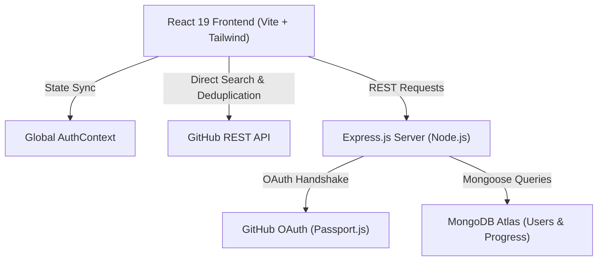

# 🚀 PRFlow – Open-Source Contribution Navigator & Developer Platform

PRFlow is a production-grade full-stack platform built to solve developer anxiety and decision fatigue when making their first open-source contributions. It combines automated GitHub issue discovery, an algorithmic beginner-scoring engine, step-by-step Git guides, dual authentication (JWT & GitHub OAuth 2.0), and a personalized Contributor Dashboard backed by MongoDB.

---

## 🌐 Live Demo & Preview
* **Frontend:** [prflow.vercel.app](https://prflow.vercel.app/)
* **Repository:** [github.com/imabhirajj/PRFlow](https://github.com/imabhirajj/PRFlow)

---

## ✨ Key Features

### 🔍 Algorithmic Issue Discovery
* Queries official GitHub REST APIs in real-time with strict tag constraints (`label:"good first issue"`, `state:open`).
* **Algorithmic Beginner Scoring Engine (out of 10):**
  * Evaluates issue titles, tags (`good first issue`, `documentation`, `first-timers-only`), activity recency, and comment density.
  * Penalizes complex issues (e.g. `refactor`, `architecture`, >10 existing comments) to keep tasks accessible for beginners.
* In-memory cache with fallback mock data to prevent GitHub API rate-limiting bottlenecks.
* Multi-dimensional filtering by skill (JavaScript, Python, TypeScript, etc.), difficulty (`Easy`, `Medium`, `Hard`), and type (`Documentation`, `Bugfix`).

### 📊 Contributor Dashboard & Progress Tracker
* Persistent MongoDB CRUD tracking via `/api/progress`:
  * **Track Contributions:** Save issues straight from the details view with one click.
  * **Live Metrics:** Real-time counters for Total Tracked, In Progress, Completed PRs, and Completion Rate.
  * **Interactive Actions:** Toggle status between *In Progress* and *Completed*, drop contributions, or open GitHub threads directly.
  * **Duplicate Prevention:** Backend validation prevents duplicate tracking of identical issue URLs.

### 🔐 Dual Authentication & Security
* **Email & Password:** Bcrypt hashed passwords (salt rounds: 10) and JSON Web Tokens (JWT).
* **GitHub OAuth 2.0:** Integrated using Passport.js (`passport-github2`) allowing developers to sign in with their existing GitHub profiles.
* **Global AuthContext:** Unified React context providing reactive auth status across navigation, protected dashboards, and action triggers.
* **Protected Routes:** Route guard preventing unauthorized access to personal dashboards.

### 🧭 Interactive Git & PR Guide
* Visual walkthrough of the standard Git contribution lifecycle (Fork, Clone, Branch, Commit, Push, PR).
* Copy-to-clipboard terminal cheatsheet for essential Git commands.

---

## 🛠 Tech Stack

### Frontend
* **Framework:** React 19 + Vite (Fast HMR & Optimized bundling)
* **Routing:** React Router DOM v7 (SPA client-side routing & Protected routes)
* **Styling:** Tailwind CSS v4 (Glassmorphism, curated HSL color palette, responsive design)
* **Animations:** Framer Motion (Orchestrated entrance/exit transitions & interactive states)
* **Icons:** Lucide React

### Backend
* **Runtime:** Node.js + Express.js
* **Database:** MongoDB Atlas + Mongoose ODM
* **Authentication:** JSON Web Tokens (JWT), Bcrypt.js, Passport.js GitHub Strategy
* **Cross-Origin Handling:** CORS configured for dev and production

---

## 🏛 System Architecture



---

## 📡 API Endpoints

### Authentication (`/api/auth`)
| Method | Endpoint | Description | Protected |
|---|---|---|---|
| `POST` | `/api/auth/signup` | Register new user with hashed password | No |
| `POST` | `/api/auth/login` | Authenticate user & return JWT token | No |
| `GET` | `/api/auth/profile` | Retrieve authenticated user profile | Yes (JWT) |
| `GET` | `/api/auth/github` | Trigger GitHub OAuth authentication flow | No |
| `GET` | `/api/auth/github/callback` | OAuth redirect callback & token exchange | No |

### Contributor Progress (`/api/progress`)
| Method | Endpoint | Description | Protected |
|---|---|---|---|
| `GET` | `/api/progress` | Fetch all tracked contributions for user | Yes (JWT) |
| `POST` | `/api/progress` | Start tracking a new GitHub issue | Yes (JWT) |
| `PUT` | `/api/progress/:id` | Update status (`Started` ↔ `Completed`) | Yes (JWT) |
| `DELETE` | `/api/progress/:id` | Remove a tracked contribution | Yes (JWT) |

---

## 🚀 Getting Started Locally

### 1. Clone the repository
```bash
git clone https://github.com/imabhirajj/PRFlow.git
cd PRFlow
```

### 2. Backend Setup
```bash
cd backend
npm install
```
Create a `.env` file in the `backend/` directory:
```env
PORT=5000
MONGO_URI=your_mongodb_connection_string
JWT_SECRET=your_jwt_secret_key
GITHUB_CLIENT_ID=your_github_oauth_client_id
GITHUB_CLIENT_SECRET=your_github_oauth_client_secret
GITHUB_CALLBACK_URL=http://localhost:5000/api/auth/github/callback
CLIENT_URL=http://localhost:5173
```
Run backend server:
```bash
npm run dev
```

### 3. Frontend Setup
```bash
cd ../frontend
npm install
```
Create a `.env` file in the `frontend/` directory:
```env
VITE_API_URL=http://localhost:5000
```
Run development server:
```bash
npm run dev
```

---

## 🌐 Production Deployment Configuration

### 1. Render (Backend) Environment Variables
Configure these in **Render Dashboard -> Environment**:
| Variable | Production Value | Description |
|---|---|---|
| `PORT` | `5000` | Port for Express service |
| `NODE_ENV` | `production` | Production environment flag |
| `MONGO_URI` | `mongodb+srv://...` | MongoDB Atlas connection string |
| `JWT_SECRET` | `<your-jwt-secret>` | Secret key for JWT token signing |
| `CLIENT_URL` | `https://prflow.vercel.app` | Frontend production URL |
| `GITHUB_CLIENT_ID` | `<your-github-client-id>` | GitHub OAuth App Client ID |
| `GITHUB_CLIENT_SECRET` | `<your-github-client-secret>` | GitHub OAuth App Client Secret |
| `GITHUB_CALLBACK_URL` | `https://prflow-backend.onrender.com/api/auth/github/callback` | OAuth callback on Render |

### 2. Vercel (Frontend) Environment Variables
Configure these in **Vercel Dashboard -> Settings -> Environment Variables**:
| Variable | Production Value | Description |
|---|---|---|
| `VITE_API_URL` | `https://prflow-backend.onrender.com` | Production backend API base URL |

### 3. GitHub Developer Settings (OAuth App)
Navigate to **GitHub -> Settings -> Developer Settings -> OAuth Apps**:
* **Application name:** `PRFlow`
* **Homepage URL:** `https://prflow.vercel.app`
* **Authorization callback URL:** `https://prflow-backend.onrender.com/api/auth/github/callback`

---

## 👨‍💻 Author
**Abhiraj**  
* GitHub: [@imabhirajj](https://github.com/imabhirajj)
